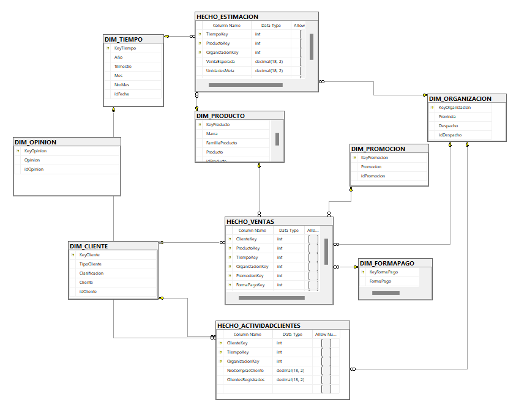
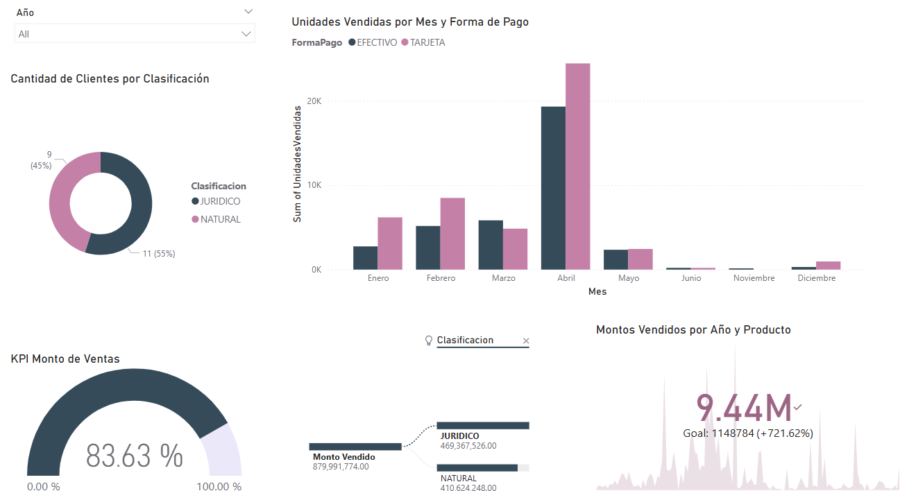

# 🚀 Data Engineering & Logistics for Technology Resources and Optimization Networks S.A.C:  BI Solution - Datamart📊

## 💡 Descripción
Solución de Business Intelligence (BI) usando la metodología Ralph Kimball, creando un Datamart de Ventas para transformar datos transaccionales en KPIs clave que ayuden en la toma de decisiones estratégicas.

## 📚 Metodología
Recolección de Información: Definición de KPIs y análisis FODA.

Diseño del Modelo: Creación de Datamart de Ventas con dimensiones y medidas.

Proceso ETL: Uso de SQL Server y Integration Services para cargar los datos y actualizar dimensiones con MERGE.

Visualización: Creación de dashboards interactivos en Power BI para los KPIs.

## 📸 Vista Previa  

  
  

## 🛠️ Tecnologías
SQL Server: Modelo dimensional y ETL.

Power BI: Visualización de KPIs.

SQL MERGE: Actualización de dimensiones.

## 🚀 Ejecución
SQL Server: Cargar datos y ejecutar scripts ETL.

Power BI: Conectar al modelo de datos y explorar el reporte SalesDashboard.pbix.

## 📊 Resultados
Optimización de ventas y toma de decisiones.

Visualización de KPIs y análisis de ventas en tiempo real.

## ⭐ Contribuye o Apóyame  

Si este proyecto te resultó interesante, dale una **⭐ en GitHub** y sígueme para más análisis de datos. También puedes sugerir mejoras o compartir tus hallazgos.  

📧 ¿Tienes dudas o ideas? Contáctame en [bryanneciosup626@gmail.com] o [LinkedIn](https://www.linkedin.com/in/brayan-rafael-neciosup-bola%C3%B1os-407a59246/).  